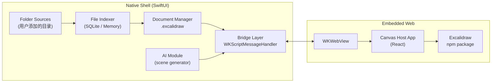

# Excalidraw Native App

macOS & iOS 本地客户端技术规格（Spec v1.0）

本文档用于直接提交给 codex 进行工程实现，覆盖：macOS / iOS（SwiftUI）+ Web Excalidraw 集成。

---

## 1. 项目目标与边界

### 1.1 核心目标
- 提供一个 macOS + iOS 原生应用。
- 支持多个用户指定目录作为 Excalidraw 文件来源。
- 启动即用、离线可用、iCloud 同步。
- 画布能力 100% 兼容官方 Excalidraw。
- 后续可扩展 AI 自动生成绘图。

### 1.2 明确边界（必须遵守）
- ❌ 禁止修改 `@excalidraw/excalidraw` npm 包源码。
- ❌ 不在 Web 端实现文件系统逻辑。
- ❌ 不依赖 Excalidraw 自带的文件打开 / 保存 UI。
- ✅ 允许在 host adapter（外层 Web App）中：
  - 配置 / 隐藏 UI。
  - 调用 Excalidraw 官方 API。
  - 转发数据给 Native。

设计原则（必须写入实现约束）：
- Excalidraw = 不可侵犯的黑盒画布引擎。
- 文件 / 目录 / iCloud / AI = Native 宿主能力。
- 所有交互通过稳定、版本化的 Bridge 协议完成。

---

## 2. 总体架构



---

## 3. 文件与目录管理设计（重点）

### 3.1 目录（Folder Source）模型

定义：
用户可以添加多个目录，应用会：
- 在侧边栏展示这些目录。
- 自动扫描目录中的 Excalidraw 文件。
- 监听目录变化并更新文件列表。

`FolderSource` 数据结构：

```swift
struct FolderSource {
    let id: UUID
    let bookmarkData: Data          // security-scoped bookmark
    let displayName: String
    let recursive: Bool             // 是否递归扫描子目录
    let addedAt: Date
}
```

平台差异：
- iOS / iPadOS
  - 使用 `UIDocumentPickerViewController` 选择文件夹。
  - 必须创建并持久化 security-scoped bookmark。
- macOS
  - 使用 `NSOpenPanel`（`canChooseDirectories = true`）。
  - 同样使用 bookmark 持久化权限。
  - 支持目录监听（FSEvents / DispatchSource）。

### 3.2 支持的文件类型（强约定）

主存储格式（唯一写入格式）：
- ✅ `*.excalidraw`
- 内容：纯 Excalidraw scene JSON
- 不添加任何私有字段

兼容识别格式（只读 / 导入）：
- `*.excalidraw.json`
- `*.excalidraw.svg`
- `*.excalidraw.png`

注意：
- svg/png 中的 embedded scene 仅用于导入或导出，不作为主存储格式。

### 3.3 文件索引（Indexer）

目标：
- 启动速度快。
- 大目录不卡 UI。
- 文件变化可增量更新。

Index 数据结构：

```swift
struct ExcalidrawFileEntry {
    let id: UUID
    let folderId: UUID
    let relativePath: String
    let fileName: String
    let fileURL: URL
    let modifiedAt: Date
    let fileSize: Int64
    let lastOpenedAt: Date?
    let thumbnailPath: String?
}
```

扫描策略：
- App 启动：
  1. 立即展示 Folder 列表（不等扫描）。
  2. 后台线程扫描文件。
- macOS：
  - 监听目录变化 → 增量更新。
- iOS：
  - 初期：启动扫描 + 手动刷新。
  - 后续可增强为文件协调器监听。

---

## 4. Web 画布集成设计

### 4.1 Web Host App（canvas-host）

角色：
- Excalidraw 的最薄宿主。
- 不提供文件系统能力。
- 所有保存 / 打开行为都通过 Native。

技术栈：
- React + TypeScript
- `@excalidraw/excalidraw`
- 构建产物：纯静态资源

构建要求：
- 构建阶段生成 `dist/`。
- Native App 在编译阶段将 `dist/` 拷贝进 Bundle。
- `WKWebView` 使用 `loadFileURL`。

### 4.2 禁用 / 隐藏 Excalidraw 内置文件 UI

允许的手段（按优先级）：
1. 使用 Excalidraw 官方 props / config。
2. 使用 host app 的 UI 控制。
3. 最后手段：CSS 隐藏（仅限 host app）。

❗禁止修改 Excalidraw 包源码。

---

## 5. Native ↔ Web Bridge 协议（核心）

### 5.1 协议版本

```ts
interface BridgeEnvelope {
  version: "1.0"
  type: string
  payload: any
}
```

### 5.2 Native → Web

加载文档：

```json
{
  "type": "loadScene",
  "payload": {
    "docId": "uuid",
    "sceneJson": { ... },
    "readOnly": false
  }
}
```

设置 App 状态：

```json
{
  "type": "setAppState",
  "payload": {
    "theme": "dark"
  }
}
```

请求导出：

```json
{
  "type": "requestExport",
  "payload": {
    "format": "png | svg | json",
    "embedScene": true
  }
}
```

### 5.3 Web → Native

标记内容变更：

```json
{
  "type": "didChange",
  "payload": {
    "docId": "uuid",
    "dirty": true
  }
}
```

请求保存：

```json
{
  "type": "saveScene",
  "payload": {
    "docId": "uuid",
    "sceneJson": { ... }
  }
}
```

导出结果：

```json
{
  "type": "exportResult",
  "payload": {
    "format": "png",
    "dataBase64": "..."
  }
}
```

### 5.4 保存策略（必须实现）
- Web 端：
  - 内容变化 → debounce（2~5s）→ `saveScene`。
- Native：
  - 串行写文件。
  - 写入 `.excalidraw`。
  - 成功后更新索引 & UI 状态。

---

## 6. 应用启动与性能要求

### 6.1 启动流程
1. App 启动。
2. 加载 Folder Sources（书签恢复）。
3. 立即创建 `WKWebView`（预热）。
4. 展示目录导航 UI。
5. 后台扫描文件。

### 6.2 性能硬性指标
- 冷启动 → 可点击界面：< 1s。
- 打开文档 → 画布可编辑：< 300ms（本地文件）。
- 不允许出现“长时间 loading 白屏”。

---

## 7. AI 扩展预留设计

### 7.1 AI 输出约定
- AI 只能输出：
  - 完整 `sceneJson`。
  - 或 `elements[]`（后续版本）。

### 7.2 接入方式

```json
{
  "type": "loadScene",
  "payload": {
    "docId": "uuid",
    "sceneJson": { ...generatedByAI }
  }
}
```

AI 模块独立于画布，无论本地模型 / 云端模型，最终都只产出 scene JSON。

---

## 8. 工程目录结构（必须遵循）

```
excalidraw-native/
├─ apps/
│  ├─ ios/
│  ├─ macos/
│  └─ shared/          # Swift Package（Folder / Index / Bridge）
├─ web/
│  └─ canvas-host/
│     ├─ src/
│     ├─ package.json
│     └─ dist/         # build output
├─ scripts/
│  └─ build_web.sh
├─ docs/
│  ├─ bridge_protocol.md
│  └─ file_format.md
```

---

## 9. Milestone 拆解（codex 执行顺序）

**Milestone 1：最小可用**
- 多目录添加。
- 扫描 `.excalidraw`。
- Web 画布加载 + 保存。

**Milestone 2：文件管理体验**
- 索引 / 排序 / 搜索。
- 缩略图。
- 最近打开。

**Milestone 3：稳定性 & 性能**
- WebView 预热。
- 自动保存。
- 崩溃恢复。

**Milestone 4：AI**
- AI 面板。
- scene 注入。

---

## 10. 验收标准（必须通过）

- ✅ 不修改 excalidraw npm 包源码。
- ✅ `.excalidraw` 文件可被其他 Excalidraw 工具直接打开。
- ✅ iCloud 同步后多设备内容一致。
- ✅ 无网络环境可完整使用。
- ✅ 启动无明显 loading。

---

## ✅ 交付状态说明

本文档已达到 codex 可直接开工级别，不需要再补需求澄清。
